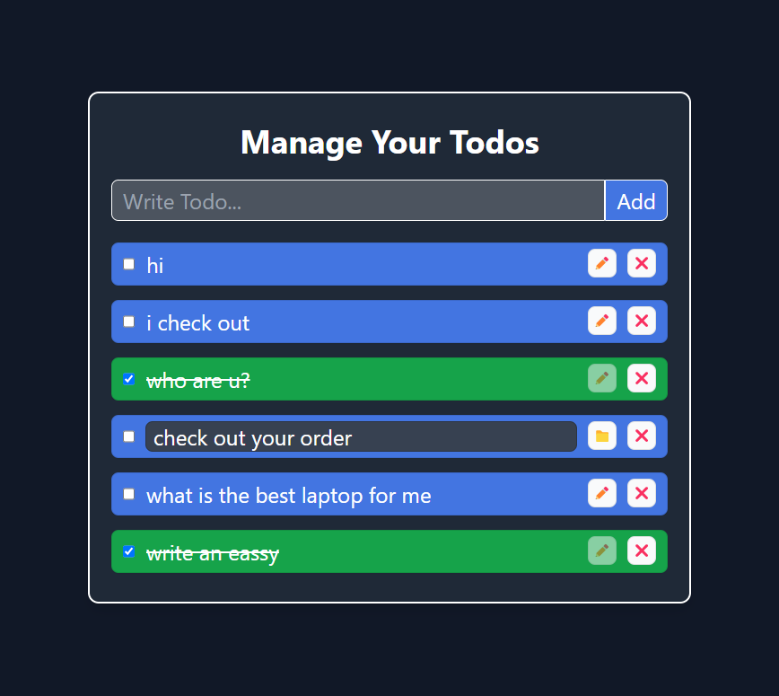

# Todo App

This is a simple and professional Todo web application built with React and TailwindCSS. The app allows users to manage their todos efficiently with options to add, update, delete, and mark todos as completed.

## Features

-   Add new todos
-   Update existing todos
-   Delete todos
-   Mark todos as completed
-   Responsive design for mobile and desktop users
-   Persist todos in local storage

## Screenshots

<div align=center>
    
</div>

## Live Demo

You can check out the live demo here: https://www.todos-erarbazansari.netlify.app

## Installation

1. Clone the repository:

    ```bash
    git clone https://github.com/erarbazansari/Todos.git
    cd Todos
    ```

2. Install the dependencies:

    ```bash
    npm install
    ```

3. Start the development server:

    ```bash
    npm run dev
    ```

## Usage

-   **Add Todo**: Type your task in the input field and click the "Add Todo" button.
-   **Update Todo**: Click on a todo item to edit it.
-   **Delete Todo**: Click the "Delete" button next to a todo item to remove it.
-   **Mark as Completed**: Check the checkbox next to a todo item to mark it as completed.
